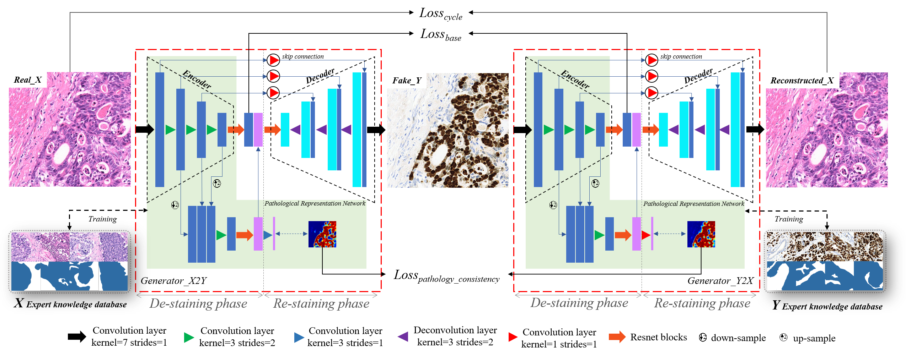

# Unpaired-Stain-Transfer-using-Pathology-Consistent-Constrained-Generative-Adversarial-Networks

Fig.3 The overview of the proposed method, which include two generators. Each generator is composed of an encoder-decoder architecture and a pathological representation network. The pathological representation network is co-trained by expert knowledge database and training dataset. The expert knowledge dataset is annotated by experienced pathologists, where blue areas are cancer lesion areas and white areas are the normal tissue areas. And the objective function includes: adversarial loss, cycle consistency loss, pathological consistency loss and base space aligned loss, where cycle consistency loss includes L1 loss and structural similarity constraint SSIM loss. 

result：

Please site:
Liu, Shuting, et al. "Unpaired Stain Transfer Using Pathology-Consistent Constrained Generative Adversarial Networks." IEEE Transactions on Medical Imaging 40.8 (2021): 1977-1989.
